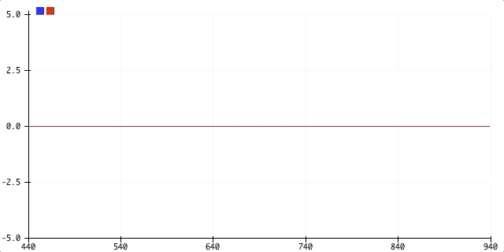
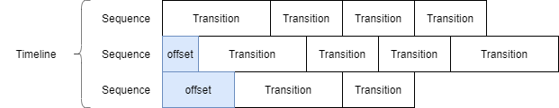
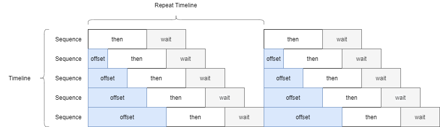

# Tween

Tween library for Arduino with Robert Penner's easing functions



## Overview

This library is consists of three classes and each `Transition` has easing function:

- `Transition` : a transition of target value (with Easing)
- `Sequence` : a series of transitions (with offset)
- `Timeline` : a collection of sequences



```C++
Tween::Timeline timeline;       // create timeline
timeline.add(target)            // add sequence to timeline
    .init(0)                    // init target value (optional)
    .offset(1000)               // delay start without transaction (optional)
    .then(10, 5000)             // add transaction (change linearly)
    .wait(1000)                 // add transaction (stay on the same value)
    .then<Ease::Sine>(0, 500);  // add transaction with Easing
```

## Simple Usage

```C++
#include <Tween.h>

Tween::Timeline timeline;
float target = 0.f;

void setup() {
    timeline.add(target) // target tweens
        .init(0)         // init target value (optional)
        .offset(1000)    // delay start 1000[ms] (optional)
        .then(10, 5000)  // to 10 in 5000[ms]
        .then(5, 5000)   // then to 5 in 5000[ms]
        .wait(1000)      // then stops 1000[ms]
        .then(0, 5000);  // then to 0 in 5000[ms]

    timeline.start();
}

void loop() {
    timeline.update(); // must be called to tween target
    Serial.println(target); // target value tweens automatically
}
```

## Use Easing Function

You can specify a easing type for each transition.

```C++
timeline.add(f)
    .then<Ease::Sine>(10, 5000)
    .then<Ease::Elastic>(5, 5000)
    .wait(1000)
    .then<Ease::Bounce>(0, 5000);
```

### Easing Types

Please refer [here](https://easings.net/) if you are not familiar with the easing. If you haven't specify the easing type, default value is `Ease::Linear`.

- BackIn, BackOut, BackInOut
- BounceIn, BounceOut, BounceInOut
- CircIn, CircOut, CircInOut
- CubicIn, CubicOut, CubicInOut
- ElasticIn, ElasticOut, ElasticInOut
- ExpoIn, ExpoOut, ExpoInOut
- LinearIn, LinearOut, LinearInOut
- QuadIn, QuadOut, QuadInOut
- QuartIn, QuartOut, QuartInOut
- QuintIn, QuintOut, QuintInOut
- SineIn, SineOut, SineInOut

```C++
// alias
using Back = BackInOut;
using Bounce = BounceInOut;
using Circ = CircInOut;
using Cubic = CubicInOut;
using Elastic = ElasticInOut;
using Expo = ExpoInOut;
using Linear = LinearInOut;
using Quad = QuadInOut;
using Quart = QuartInOut;
using Quint = QuintInOut;
using Sine = SineInOut;
```

## Use Custom Class for the Target Value

You can use custom classes if you have implemented following operators.

- `operator+(const T&)`
- `operator-(const T&)`
- `operator*(const double)`

If you have these operator overloads, you can use that variable completely as same as other built-in variables.
Please see `custom_class` example for details.

```C++
// CAUTION: just a simplified operator overloads
struct Vec2 {
    float x;
    float y;

    Vec2() : x(0), y(0) {}
    Vec2(const float x, const float y) : x(x), y(y) {}

    Vec2 operator+(const Vec2& rhs) const {
        return Vec2(x + rhs.x, y + rhs.y);
    }
    Vec2 operator-(const Vec2& rhs) const {
        return Vec2(x - rhs.x, y - rhs.y);
    }
    Vec2 operator*(const double f) const {
        return Vec2(x * f, y * f);
    }
};

Tween::Timeline timeline;
Vec2 v;

void setup() {
    timeline.add(v)
        .then(Vec2(10, 8), 5000)
        .then(Vec2(5, 10), 5000)
        .wait(3000)
        .then<Ease::Bounce>(Vec2(0, 0), 7000);

    timeline.start();
}

void loop() {
    timeline.update();
}
```

## Control Timeline with Mode, Auto Erase, and Offset

### Timeline Mode

There are 3 play mode for the `Timeline`.

```C++
timeline.mode(Tween::Mode::ONCE);      // default: stop timeline if finished
timeline.mode(Tween::Mode::REPEAT_TL); // repeat whole timeline if finished
timeline.mode(Tween::Mode::REPEAT_SQ); // repeat each sequence if finished
```

### Auto Erase the Sequence

You can choose if you automatically erase the each sequence. This is not affected by timeline mode. If you choose to erase the sequence automatically, it will be erased after the first loop is finished. The default value is `false`.

```C++
timeline.add(v, true)  // erase this sequence automatically (default: false)
    .then(10, 5000)
    .then(0, 5000);
```

### Sequence Offset

Offset is added only once in the begging of the timeline. Offset behaves differently especially based on the `REPEAT_TL` and `REPEAT_SQ` mode.

- `REPEAT_TL` : Offset is always added in every loop
- `REPEAT_SQ` : Offset is added only once in the beggining (not included in loop)


### Example of Mode and Offset

```C++
Timeline timeline;
float value[5];

for (size_t i = 0; i < 5; ++i) {
    timeline.add(value[i])
        .offset(i * 1000)
        .then(3, 1000)
        .wait(2000);
}
```

### Behavior: `Tween::Mode::REPEAT_TL`



### Behavior: `Tween::Mode::REPEAT_SQ`


## APIs

### `Timeline`

```C++
template <typename T>
Sequence<T>& add(T& target, const bool b_auto_erase = false);

void start();
bool update();

void clear();

void mode(const Mode m);
Mode mode() const;

size_t size() const;

template <typename T>
const Sequence<T>& operator[](const T& t);
template <typename T>
Sequence<T>& operator[](T& t);
```

### `Sequence<T>`

```C++
template <typename U = T>
auto init(const U& to)
-> typename std::enable_if<std::is_convertible<U, T>::value, Sequence<T>&>::type;

template <typename EasingType = Ease::Linear, typename U = T>
auto then(const U& to, const double in = 0)
-> typename std::enable_if<std::is_convertible<U, T>::value, Sequence<T>&>::type;

Sequence<T>& wait(const double in);

Sequence<T>& offset(const double ms);
```

## Embedded Libraries

- [Easing v0.1.0](https://github.com/hideakitai/Easing)
- [PollingTimer v0.4.1](https://github.com/hideakitai/PollingTimer)
- [ArxTypeTraits v0.2.1](https://github.com/hideakitai/ArxTypeTraits)
- [ArxContainer v0.3.14](https://github.com/hideakitai/ArxContainer)
- [ArxSmartPtr v0.2.1](https://github.com/hideakitai/ArxSmartPtr)
- [TeensyDirtySTLErrorSolution v0.1.0](https://github.com/hideakitai/TeensyDirtySTLErrorSolution)

## License

MIT
