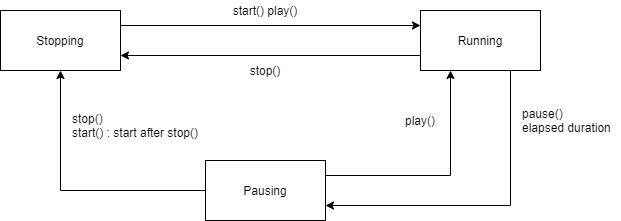

# PollingTimer

Arduino library to manage timing and event in a flexible way with polling

## Feature

- Four timers based on the situation
  - `PollingTimer`
  - `IntervalCounter`
  - `FrameRateCounter`
  - `OneShotTimer`
- Timer events with callback / lambda
- Various APIs to control timers
- 64bit support

## Usage

### `PollingTimer`

```C++
#include <PollingTimer.h>
PollingTimer timer;

void setup() {
    Serial.begin(115200);
    timer.start();
}

void loop() {
    if (timer.isRunning()) {
        Serial.println(timer.msec());
    }
}
```

### `IntervalCounter`

```C++
#include <IntervalCounter.h>
IntervalCounter interval(1.0); // interval is 1.0[sec]

void setup() {
    interval.onUpdate([&]() {
        Serial.print("interval count = ");
        Serial.print(interval.count());
        Serial.print(", time = ");
        Serial.println(interval.ms());
    });

    interval.start();
}

void loop() {
    interval.update(); // event occurs if interval is changed
}
```

### `FrameRateCounter`

```C++
#include <FrameRateCounter.h>
FrameRateCounter fps(30); // set framrate to 30[Hz]

void setup() {
    fps.onUpdate([&]() {
        Serial.print("frame no. = ");
        Serial.print(fps.frame());
        Serial.print(", time = ");
        Serial.println(fps.msec());
    });

    fps.start();
}

void loop() {
    fps.update(); // event occurs if fram has changed
}
```

### `OneShotTimer`

```C++
#include <OneShotTimer.h>
OneShotTimer onshot(5); // event will be

void setup() {
    oneshot.onUpdate([&]() {
        Serial.print("oneshot event, time = ");
        Serial.println(millis());
    });

    oneshot.start();
}

void loop() {
    oneshot.update(); // event occurs only once if time has elapsed
}
```

## PollingTimer States Transition



## APIs

### `PollingTimer` (also available on all timer)

```C++
virtual void start();
virtual void stop();
virtual void play();
virtual void pause();
virtual void restart();
virtual void clear();

void startFromSec(const double from_sec);
void startFromMsec(const double from_ms);
void startFromUsec(const double from_us);
void startForSec(const double for_sec, const bool loop = false);
void startForMsec(const double for_ms, const bool loop = false);
void startForUsec(const double for_us, const bool loop = false);
void startFromForSec(const double from_sec, const double for_sec, const bool loop = false);
void startFromForMsec(const double from_ms, const double for_ms, const bool loop = false);
void startFromForUsec(const double from_us, const double for_us, const bool loop = false);
void startFromForUsec64(const int64_t from_us, const int64_t for_us, const bool loop = false);

bool isRunning() const;
bool isPausing() const;
bool isStopping() const;

bool hasStarted() const;
bool hasPaused() const;
bool hasStopped() const;

int64_t usec64();
double usec();
double msec();
double sec();

double getOrigin() const;
uint32_t getOverflow() const;

double getOffsetUsec64() const;
double getOffsetUsec() const;
double getOffsetMsec() const;
double getOffsetSec() const;

int64_t getDurationUsec64() const;
double getDurationUsec() const;
double getDurationMsec() const;
double getDurationSec() const;

double getRemainingTime();
double getRemainingLife();

void setOffsetUsec64(const int64_t us);
void setOffsetUsec(const double us);
void setOffsetMsec(const double ms);
void setOffsetSec(const double sec);

void addOffsetUsec64(const int64_t us);
void addOffsetUsec(const double us);
void addOffsetMsec(const double ms);
void addOffsetSec(const double sec);

void setDurationUsec64(const int64_t us);
void setDurationUsec(const double us);
void setDurationMsec(const double ms);
void setDurationSec(const double sec);

void setTimeUsec64(const int64_t u);
void setTimeUsec(const double u);
void setTimeMsec(const double m);
void setTimeSec(const double s);

void setLoop(const bool b);
bool isLoop() const;

bool hasOffset() const;
bool hasDuration() const;

void onStart(const std::function<void(void)>& cb);
void onPause(const std::function<void(void)>& cb);
void onStop(const std::function<void(void)>& cb);

void removeEventOnStart();
void removeEventOnPause();
void removeEventOnStop();

bool hasEventOnStart() const;
bool hasEventOnPause() const;
bool hasEventOnStop() const;
```

### `IntervalCounter` (also available on `FrameRateCounter` & `OneShotTimer`)

```C++
explicit IntervalCounter (const double sec = 0.);

void startFromCount(const double from_count);
void startForCount(const double for_count, const bool loop = false);
void startFromForCount(const double from_count, const double for_count, const bool loop = false);

void startIntervalSec(const double interval_sec);
void startIntervalMsec(const double interval_ms);
void startIntervalUsec(const double interval_us);

void startIntervalFromSec(const double interval_sec, const double from_sec);
void startIntervalFromMsec(const double interval_ms, const double from_ms);
void startIntervalFromUsec(const double interval_us, const double from_us);
void startIntervalSecFromCount(const double interval_sec, const double from_count);
void startIntervalMsecFromCount(const double interval_ms, const double from_count);
void startIntervalUsecFromCount(const double interval_us, const double from_count);

void startIntervalForSec(const double interval_sec, const double for_sec, const bool loop = false);
void startIntervalForMsec(const double interval_ms, const double for_ms, const bool loop = false);
void startIntervalForUsec(const double interval_us, const double for_us, const bool loop = false);
void startIntervalSecForCount(const double interval_sec, const double for_count, const bool loop = false);
void startIntervalMsecForCount(const double interval_ms, const double for_count, const bool loop = false);
void startIntervalUsecForCount(const double interval_us, const double for_count, const bool loop = false);

void startIntervalFromForSec(const double interval_sec, const double from_sec, const double for_sec, const bool loop = false);
void startIntervalFromForMsec(const double interval_ms, const double from_ms, const double for_ms, const bool loop = false);
void startIntervalFromForUsec(const double interval_us, const double from_us, const double for_us, const bool loop = false);
void startIntervalSecFromForCount(const double interval_sec, const double from_count, const double for_count, const bool loop = false);
void startIntervalMsecFromForCount(const double interval_ms, const double from_count, const double for_count, const bool loop = false);
void startIntervalUsecFromForCount(const double interval_us, const double from_count, const double for_count, const bool loop = false);

void startOnce();
void startOnceAfterSec(const double after_sec);
void startOnceAfterMsec(const double after_ms);
void startOnceAfterUsec(const double after_us);

void stop();
double count();

double getIntervalUsec64() const;
double getIntervalUsec() const;
double getIntervalMSec() const;
double getIntervalSec() const;

void setIntervalUsec64(const int64_t u64);
void setIntervalUsec(const double us);
void setIntervalMsec(const double ms);
void setIntervalSec(const double sec);

bool hasInterval() const;
void setOffsetCount(const double count);
void onUpdate(const std::function<void(void)>& f);
bool hasEventOnUpdate() const;
void removeEventOnUpdate();
bool update();;
```

### `FrameRateCounter` only

```C++
explicit FrameRateCounter(const double fps = 1000000.);

void startFromFrame(const double from_frame);
void startForFrame(const double for_frame, const bool loop = false);
void startFromForFrame(const double from_frame, const double for_frame, const bool loop = false);

void startFps(const double fps);

void startFpsFromSec(const double fps, const double from_sec);
void startFpsFromMsec(const double fps, const double from_ms);
void startFpsFromUsec(const double fps, const double from_us);
void startFpsFromFrame(const double fps, const double from_frame);

void startFpsForSec(const double fps, const double for_sec, const bool loop = false);
void startFpsForMsec(const double fps, const double for_ms, const bool loop = false);
void startFpsForUsec(const double fps, const double for_us, const bool loop = false);
void startFpsForFrame(const double fps, const double for_frame, const bool loop = false);

void startFpsFromForSec(const double fps, const double from_sec, const double for_sec, const bool loop = false);
void startFpsFromForMsec(const double fps, const double from_ms, const double for_ms, const bool loop = false);
void startFpsFromForUsec(const double fps, const double from_us, const double for_us, const bool loop = false);
void startFpsFromForFrame(const double fps, const double from_frame, const double for_frame, const bool loop = false);

double frame();
void setFrameRate(const double fps);
double getFrameRate() const;
```

### `OneShotTimer` only

```C++
explicit OneShotTimer(const double sec);
OneShotTimer(const double sec, const std::function<void(void)>& f);
void start();
```

## Embedded Libraries

- [ArxTypeTraits v0.2.3](https://github.com/hideakitai/ArxTypeTraits)
- [TeensyDirtySTLErrorSolution v0.1.0](https://github.com/hideakitai/TeensyDirtySTLErrorSolution)

## Used Inside of

- [Tween](https://github.com/hideakitai/Tween)
- [TaskManager](https://github.com/hideakitai/TaskManager)

## License

MIT
